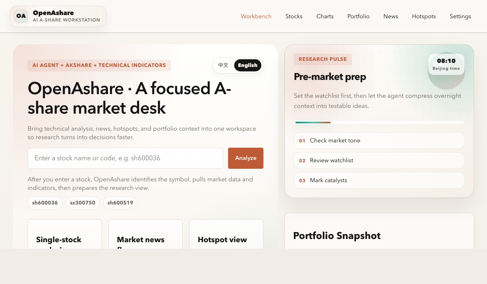
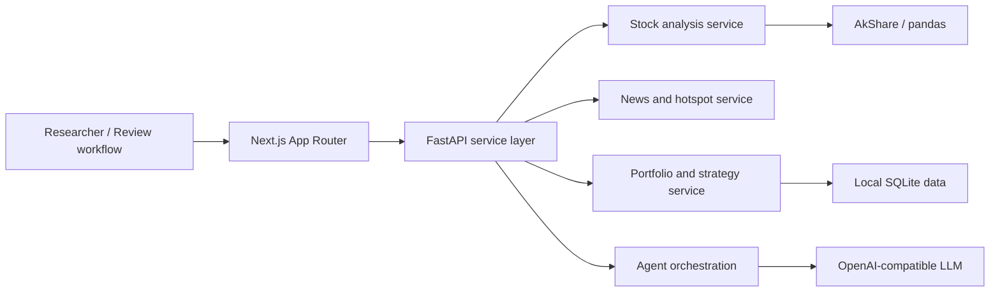

# OpenAshare

<p align="center">
  <a href="README.md">中文</a>
  ·
  <a href="README.en.md"><strong>English</strong></a>
</p>

> A local-first, self-hostable AI research workstation for China's A-share market.

<p align="center">
  
</p>

<p align="center">
  <a href="https://nextjs.org/"></a>
  <a href="https://fastapi.tiangolo.com/"></a>
  <a href="https://www.python.org/"></a>
  
  
  <a href="LICENSE"></a>
</p>

OpenAshare is not just another market dashboard. It is a research desk built for the daily workflow of A-share investors, builders, and self-hosting enthusiasts.

It brings single-stock technical analysis, market news, sector hotspots, portfolio review, strategy observation, and agent chat into one connected research loop. Start from a stock code and move through price action, indicators, news, and AI commentary. Start from a hotspot and trace it back to representative stocks. Ask the agent follow-up questions with portfolio context still nearby.

It is also not a black box. You can run it locally, self-host it, connect DeepSeek, OpenAI-compatible APIs, or a local model gateway, and reshape the workspace around your own research habits.

> Disclaimer: This project is for research, learning, and tool-building only. It is not investment advice. Markets involve risk, and all decisions are your own responsibility.

## Why OpenAshare

A-share research is often fragmented: prices in one app, news in another, holdings in a spreadsheet, charts somewhere else, and AI chat in a separate window. The information exists, but the context breaks.

OpenAshare turns that fragmented process into a controllable workspace:

- **Designed around the A-share workflow**: stocks, sector themes, announcements, portfolio context, strategy candidates, and market rhythm are first-class paths.
- **AI that supports research instead of replacing judgment**: the agent can summarize, connect, explain, and ask better follow-up questions while the interface keeps data and indicators visible.
- **Local-first and self-hostable**: settings, holdings, and parts of the research state stay close to your own environment, making it useful for personal research, internal demos, and private deployment.
- **Bring your own model**: switch providers through environment variables or the settings page instead of locking the research loop to one AI platform.
- **Clean full-stack boundaries**: FastAPI handles analysis and orchestration; Next.js handles the product experience; the codebase is ready to extend.

## Preview

| Workbench | News Flow | Single-Stock Analysis |
| --- | --- | --- |
|  |  |  |

## Core Features

### Research Workbench

- Search by stock name or code
- View market snapshots, technical indicators, and AI insights together
- Track analysis progress with frontend event feedback
- Follow market rhythm across pre-market, live session, midday review, and post-market review

### News and Hotspots

- Browse stock-specific and market-wide news
- Aggregate market themes with heat scores and related stocks
- Drill into hotspot details, related catalysts, and historical heat
- Use market regime context for risk-on / neutral / risk-off interpretation

### Portfolio and Strategy

- Maintain local holdings, cost basis, and position sizes
- Review portfolio P&L, concentration risk, and rebalance suggestions
- Track strategy candidates and watchlists
- Review strategy holdings with status and action prompts

### Agent Chat

- Use one research chat entry across pages
- Let the agent call stock, hotspot, news, and portfolio services
- Keep conversation context and tool progress visible
- Fall back to rule-based analysis when the AI engine is unavailable

## Architecture



## Tech Stack

- **Frontend**: Next.js App Router, React 19, TypeScript, lightweight-charts
- **Backend**: FastAPI, Pydantic, SSE progress events
- **Data & Analysis**: AkShare, pandas, custom technical analysis and strategy services
- **Storage**: SQLite, local JSON settings
- **AI**: OpenAI-compatible API with configurable base URL, model, and API key

## Quick Start

### Requirements

- Python 3.12+
- Node.js 20+
- npm

### 1. Install backend dependencies

```bash
python3 -m venv .venv
source .venv/bin/activate
pip install -r requirements_api.txt
```

If you need the legacy analysis flow or extra local analysis modules, also install:

```bash
pip install -r requirements.txt
```

### 2. Install frontend dependencies

```bash
npm install
```

### 3. Configure environment variables

Create `.env` in the project root:

```env
LLM_API_KEY=your_api_key
LLM_BASE_URL=https://api.deepseek.com
LLM_MODEL=deepseek-chat
MONITOR_DB_PATH=./data/monitor.db
NEXT_PUBLIC_API_BASE_URL=http://127.0.0.1:8000
```

Optional: configure an Eastmoney suggest token if you want online stock search autocomplete. Do not commit real tokens:

```env
EASTMONEY_TOKEN=your_eastmoney_suggest_token
```

Optional: configure a demo access code if you want to expose a public demo while protecting selected pages:

```env
DEMO_ACCESS_CODE=your_demo_code
DEMO_ACCESS_SECRET=your_cookie_signing_secret
```

### 4. Start the API

```bash
./scripts/run_api.sh
```

Default backend URL: `http://127.0.0.1:8000`

### 5. Start the frontend

```bash
npm run dev
```

Default frontend URL: `http://127.0.0.1:3000`

## Project Structure

```text
.
├── api/          # FastAPI entrypoints, schemas, SSE, and service orchestration
├── app/          # Next.js App Router pages
├── components/   # Frontend UI components
├── lib/          # Frontend API client, shared types, and utilities
├── ashare/       # Analysis engine, market search, monitoring, and data modules
├── scripts/      # Local run scripts
├── tests/        # API and search tests
└── assets/       # Screenshots, styles, report templates, and other assets
```

## Pages

- `/`: product landing page with Chinese / English switching
- `/work`: research workbench
- `/stocks`: stock search and single-stock analysis
- `/charts`: candlestick charts
- `/news`: market news and stock news
- `/hotspots`: market themes and related stocks
- `/portfolio`: holdings, portfolio risk, and strategy review
- `/agent`: agent research chat
- `/settings`: model and service configuration

## Validation

```bash
python -m pytest tests/test_api_app.py -q
npm run build
```

## Who It Is For

- Developers who want a private A-share research desk
- Engineers exploring AI agents in real financial research workflows
- Learners studying a FastAPI + Next.js full-stack project
- Investors and researchers who want a local loop across holdings, news, hotspots, and strategy notes

## Roadmap Ideas

- More data source adapters and caching strategies
- Backtesting, trading calendars, and strategy performance panels
- Finer-grained agent tool calls and citation tracing
- Multi-user permissions, team sharing, and deployment templates
- Broader test coverage and CI workflows

## Contributing

Issues, discussions, and pull requests are welcome. To keep the project healthy:

- Prefer small, focused changes
- Keep `api/schemas.py` and `lib/types.ts` aligned when API contracts change
- Never commit real API keys, private config, or machine-local files
- Preserve the core product shape: stock analysis, news, hotspots, portfolio, strategy, and agent chat

If OpenAshare is useful or sparks an idea, a GitHub Star helps more A-share builders discover it.

## License

[MIT](LICENSE)
