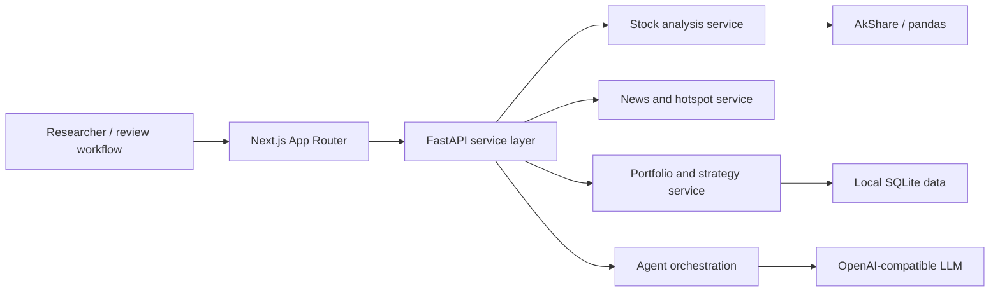

# OpenAshare

<p align="center">
  <a href="README.md">中文</a> · <a href="README.en.md"><strong>English</strong></a>
</p>

<p align="center">
  <strong>An AI research desk for China and Hong Kong equities.</strong><br />
  Move from market context and technicals to an agent that remembers the question.
</p>

<p align="center">
  <a href="https://github.com/ZhiweiChen-coder/OpenAshare/stargazers"></a>
  <a href="https://nextjs.org/"></a>
  <a href="https://fastapi.tiangolo.com/"></a>
  <a href="https://www.python.org/"></a>
  <a href="LICENSE"></a>
</p>

<p align="center">
  
</p>

> **The hosted Beta is opening.** Visit the product home, sign in, and request access to the cloud workspace — or run this repository locally and keep control of your data and model setup.

OpenAshare is not another market dashboard. It connects technical analysis, market news, sector themes, portfolio review, strategy tracking, and agent chat into one research loop. Start with a ticker and move through price action, indicators, news, and an AI explanation you can keep questioning. Start with a market theme and trace it back to representative equities and your portfolio context.

It is local-first and self-hostable by design. The product is being built in Chinese and English for overseas Chinese investors and international researchers who want a clearer way into China and Hong Kong equity research.

> Disclaimer: this project is for research, learning, and tool-building only. It is not investment advice. Markets involve risk; all decisions remain your own.

## Star growth

<p align="center">
  <a href="https://star-history.com/#ZhiweiChen-coder/OpenAshare&amp;Date">
    
  </a>
</p>

The chart is supplied by [Star History](https://star-history.com/#ZhiweiChen-coder/OpenAshare&Date) and refreshes with public Star data. Select it for the interactive history.

## Why OpenAshare

China equity research is often fragmented: prices in one app, news in another, holdings in a spreadsheet, charts somewhere else, and AI chat in a separate window. The information is there; the context is not.

- **One path from question to judgment**: market data, technical indicators, news, themes, and portfolio context can lead into each other without repeatedly pasting context.
- **Agent-assisted, not black-box**: use AI to summarize, connect, explain, and follow up while keeping the underlying data and indicators visible.
- **China / Hong Kong equity context**: built around the A-share workflow, with Hong Kong ticker support and an English entry point for global researchers.
- **Local-first and model-flexible**: connect DeepSeek, an OpenAI-compatible API, or a local model gateway; suitable for personal research, private deployment, and extension.

## Product preview

| Agent research desk | Charts and technical context |
| --- | --- |
|  |  |

### Research desk and agent

- Search by stock name or code; keep market snapshots, technical indicators, and AI insights together.
- Ask research questions from any page while retaining conversation context and tool progress.
- Call stock, theme, news, and portfolio services; fall back to rule-based analysis if the model is unavailable.
- Work with prompts shaped for pre-market, live session, midday review, and post-market review.

### Market context, themes, and charts

- Unified A-share, Hong Kong, and US equity search; A-share research uses Ashare / AkShare and Hong Kong tickers include formats such as `00700.HK`.
- Stock news, market updates, themed hotspots, heat scores, and related equities.
- Candlesticks, technical indicators, signals, and risk-on / neutral / risk-off context.

### Portfolio and strategy

- Local holdings, cost basis, and position size management.
- Portfolio P&L, concentration-risk review, rebalance suggestions, and watchlists.
- Strategy candidate screens, state tracking, and review prompts.

## Architecture


```mermaid
flowchart LR
  User["Researcher / review workflow"] --> UI["Next.js App Router"]
  UI --> API["FastAPI service layer"]
  API --> Stock["Stock analysis service"]
  API --> News["News and hotspot service"]
  API --> Portfolio["Portfolio and strategy service"]
  API --> Agent["Agent orchestration"]
  Stock --> AkShare["AkShare / pandas"]
  Portfolio --> SQLite["Local SQLite data"]
  Agent --> LLM["OpenAI-compatible LLM"]
```

## Tech stack

- **Frontend**: Next.js App Router, React 19, TypeScript, lightweight-charts
- **Backend**: FastAPI, Pydantic, SSE progress events
- **Data & analysis**: AkShare, pandas, custom technical-analysis and strategy services
- **Storage**: SQLite and local JSON settings
- **AI**: OpenAI-compatible API with configurable base URL, model, and API key

## Run locally

### Requirements

- Python 3.12+
- Node.js 20+
- npm

### 1. Install dependencies

```bash
python3 -m venv .venv
source .venv/bin/activate
pip install -r requirements_api.txt
npm install
```

Install the legacy analysis flow and extra local analysis modules only when needed:

```bash
pip install -r requirements.txt
```

### 2. Configure a model (optional)

Create `.env` in the project root. Without a model configuration, selected agent capabilities fall back to rule-based analysis.

```env
LLM_API_KEY=your_api_key
LLM_BASE_URL=https://api.deepseek.com
LLM_MODEL=deepseek-chat
MONITOR_DB_PATH=./data/monitor.db
```

Set `EASTMONEY_TOKEN` only when you need Eastmoney online stock-search autocomplete. Never commit a real token.

### 3. Start the API and frontend

Use the default ports:

```bash
./scripts/run_api.sh      # http://127.0.0.1:8000
npm run dev               # http://127.0.0.1:3000
```

If another service already uses `8000` / `3000`, run a parallel development instance:

```bash
API_PORT=8001 ./scripts/run_api.sh
```

Then create `.env.local`:

```env
NEXT_PUBLIC_API_BASE_URL=http://127.0.0.1:8001
```

Restart Next.js and run:

```bash
npm run dev -- -p 3001
```

## Pages

- `/`: bilingual product home and hosted Beta entry
- `/work`: main research desk and agent entry (`/agent` redirects here)
- `/stocks`: stock search and single-stock analysis
- `/charts`: candlestick charts and technical indicators
- `/news`: market and stock news
- `/hotspots`: themes and related equities
- `/portfolio`: holdings, portfolio risk, and strategy review
- `/settings`: model and service configuration

## Project structure

```text
.
├── api/          # FastAPI entrypoints, schemas, SSE, and service orchestration
├── app/          # Next.js App Router pages
├── components/   # Frontend UI components
├── lib/          # Frontend API client, shared types, and utilities
├── ashare/       # Analysis engine, market search, monitoring, and data modules
├── scripts/      # Local run scripts
├── tests/        # API and search tests
└── assets/       # Product screenshots and other assets
```

## Verify

```bash
python -m pytest tests/test_api_app.py -q
npm run build
```

## Roadmap

- Login request and feedback loop for the hosted Beta
- More China / Hong Kong data sources, caching, and citation tracing
- Backtesting, trading calendars, and strategy performance panels
- More granular agent tools, citations, and research memory
- Team collaboration, permissions, and one-click deployment templates

## Contributing

Issues, discussions, and pull requests are welcome. Please:

- Prefer small, focused changes.
- Keep `api/schemas.py` and `lib/types.ts` aligned when API contracts change.
- Never commit real API keys, private configuration, or machine-local files.
- Preserve the core product paths: stock analysis, news, hotspots, portfolio, strategy, and agent chat.

## License

[MIT](LICENSE)
