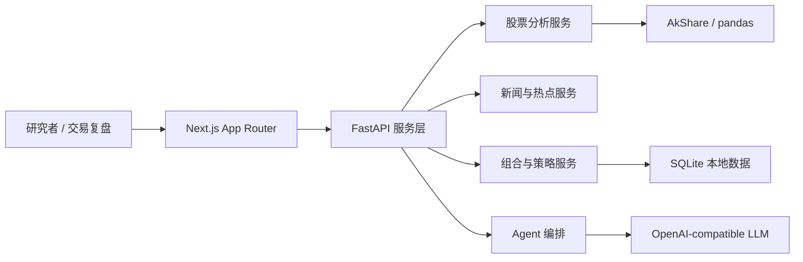

# OpenAshare

<p align="center">
  <a href="README.md"><strong>中文</strong></a>
  ·
  <a href="README.en.md">English</a>
</p>

> 一个本地优先、可自托管、可替换模型的 A 股 AI 研究工作台。

<p align="center">
  
</p>

<p align="center">
  <a href="https://nextjs.org/"></a>
  <a href="https://fastapi.tiangolo.com/"></a>
  <a href="https://www.python.org/"></a>
  
  
  <a href="LICENSE"></a>
</p>

OpenAshare 想做的不是又一个行情看板，而是一个可以真正放在日常研究流里的 A 股智能桌面。

它把单股技术分析、市场消息、热点主题、持仓复盘、策略观察和 Agent 对话放在同一条链路里：你可以从一个股票代码开始，看到行情、指标、新闻和 AI 观点；也可以从热点主题回到代表个股；还可以让 Agent 带着持仓语境继续追问。少一点页面切换，多一点连续判断。

它也不是黑盒。你可以本地运行，可以自托管，可以接 DeepSeek、OpenAI-compatible API 或本地模型网关，也可以继续按自己的研究习惯改造。

> 重要提示：本项目用于研究、学习和工具搭建，不构成投资建议。市场有风险，决策请自行负责。

## 为什么做 OpenAshare

很多 A 股研究流程是碎的：行情软件看价格，新闻页看催化，表格记持仓，K 线图看形态，AI 聊天窗口再单独问一遍。信息都在，但上下文经常断。

OpenAshare 试图把这些碎片收进一个可控的工作台：

- **围绕 A 股组织信息**：个股、板块热点、公告新闻、持仓组合、策略候选和市场节奏是一等入口。
- **让 AI 参与研究，而不是替你拍脑袋**：Agent 可以解释、归纳、串联和追问，但页面仍保留数据、指标和可复核的分析过程。
- **本地优先，适合自托管**：配置、持仓和部分研究数据优先留在本地环境，适合个人研究、内部演示和私有化部署。
- **模型可替换**：通过设置页或环境变量切换模型供应商，不把研究链路锁在单一平台。
- **前后端边界清晰**：FastAPI 负责分析与服务编排，Next.js 负责交互体验，适合继续扩展成自己的研究系统。

## 功能预览

| 工作台 | 消息流 | 单股分析 |
| --- | --- | --- |
|  |  |  |

## 核心能力

### 研究工作台

- 股票名称 / 代码搜索
- 行情快照、技术指标和 AI insight 同屏展示
- 研究进度事件流，适合较长的分析任务
- 盘前、盘中、午间、盘后不同研究节奏提示

### 新闻与热点

- 个股新闻与全局市场消息浏览
- 热点主题聚合、热度分数和关联标的
- 热点详情页串联相关消息与历史热度
- 市场状态辅助判断 risk-on / neutral / risk-off

### 持仓与策略

- 本地组合录入、持仓成本和数量管理
- 组合盈亏、集中度风险和再平衡建议
- 策略候选筛选与观察清单
- 策略持仓复盘、状态跟踪和行动提示

### Agent 对话

- 跨页面统一的研究问答入口
- 可调用股票分析、热点、新闻、组合等服务
- 支持会话上下文与工具调用进度
- 智能引擎不可用时回退到规则分析路径

## 技术架构



## 技术栈

- **Frontend**：Next.js App Router、React 19、TypeScript、lightweight-charts
- **Backend**：FastAPI、Pydantic、SSE progress events
- **Data & Analysis**：AkShare、pandas、自定义技术分析与策略服务
- **Storage**：SQLite、本地 JSON 设置文件
- **AI**：OpenAI-compatible API，可配置 base URL、model 和 API key

## 快速开始

### 环境要求

- Python 3.12+
- Node.js 20+
- npm

### 1. 安装后端依赖

```bash
python3 -m venv .venv
source .venv/bin/activate
pip install -r requirements_api.txt
```

如果你还需要运行旧分析链路或更多本地分析能力，可以额外安装：

```bash
pip install -r requirements.txt
```

### 2. 安装前端依赖

```bash
npm install
```

### 3. 配置环境变量

在项目根目录创建 `.env`：

```env
LLM_API_KEY=your_api_key
LLM_BASE_URL=https://api.deepseek.com
LLM_MODEL=deepseek-chat
MONITOR_DB_PATH=./data/monitor.db
NEXT_PUBLIC_API_BASE_URL=http://127.0.0.1:8000
```

可选：如果需要使用东方财富在线股票搜索补全，请自行配置 suggest token。不要把真实 token 提交到仓库：

```env
EASTMONEY_TOKEN=your_eastmoney_suggest_token
```

可选：如果你要公开演示并保护部分页面，可以配置演示访问码：

```env
DEMO_ACCESS_CODE=your_demo_code
DEMO_ACCESS_SECRET=your_cookie_signing_secret
```

### 4. 启动 API

```bash
./scripts/run_api.sh
```

默认后端地址：`http://127.0.0.1:8000`

### 5. 启动前端

```bash
npm run dev
```

默认前端地址：`http://127.0.0.1:3000`

## 项目结构

```text
.
├── api/          # FastAPI 入口、schemas、SSE 与服务编排
├── app/          # Next.js App Router 页面
├── components/   # 前端 UI 组件
├── lib/          # 前端 API client、共享类型和工具
├── ashare/       # 分析引擎、行情搜索、监控与数据模块
├── scripts/      # 本地启动脚本
├── tests/        # API 与搜索相关测试
└── assets/       # 截图、样式、报告模板等资源
```

## 页面概览

- `/`：产品主页，支持中英文切换
- `/work`：研究工作台
- `/stocks`：股票搜索与单股分析
- `/charts`：K 线图
- `/news`：市场消息与个股新闻
- `/hotspots`：热点主题与关联标的
- `/portfolio`：持仓组合与风险分析
- `/agent`：Agent 研究对话
- `/settings`：模型与服务配置

## 验证

```bash
python -m pytest tests/test_api_app.py -q
npm run build
```

## 适合谁

- 想搭一个私有 A 股研究工作台的个人开发者
- 想把 AI Agent 接入真实金融研究流程的工程师
- 想研究 FastAPI + Next.js 全栈项目结构的学习者
- 想在本地组合、新闻、热点和策略之间建立闭环的投资研究爱好者

## Roadmap 灵感

- 更多数据源适配与缓存策略
- 回测、交易日历与策略绩效面板
- 更细颗粒度的 Agent 工具调用与引用追踪
- 多用户权限、团队共享和部署模板
- 更完整的测试覆盖与 CI workflow

## 贡献

欢迎 Issue、Discussion 和 Pull Request。为了保持项目清爽，建议贡献时遵循：

- 优先提交小而聚焦的改动
- API contract 变更时同步更新 `api/schemas.py` 与 `lib/types.ts`
- 不提交真实 API key、私有配置或机器本地文件
- 尽量保留项目主线：股票分析、新闻、热点、持仓、策略和 Agent 对话

如果这个项目对你有启发，欢迎 Star。它会让这个小小的 A 股研究台更容易被同路人发现。

## License

[MIT](LICENSE)
