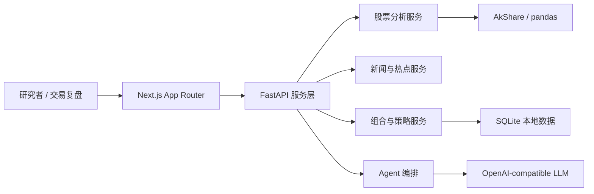

# OpenAshare

<p align="center">
  <a href="README.md"><strong>中文</strong></a>
  ·
  <a href="README.en.md">English</a>
</p>

<p align="center">
  <strong>面向中国与香港股票的 AI 研究工作台。</strong><br />
  从行情、新闻和技术面，到带上下文的 Agent 研究，一处完成。
</p>

<p align="center">
  <a href="https://github.com/ZhiweiChen-coder/OpenAshare/stargazers"></a>
  <a href="https://nextjs.org/"></a>
  <a href="https://fastapi.tiangolo.com/"></a>
  <a href="https://www.python.org/"></a>
  <a href="LICENSE"></a>
</p>

<p align="center">
  
</p>

> **云端 Beta 正在开放。** 想先体验云端工作台？访问产品首页并登录后申请 Beta 访问；想自己掌控数据与模型？直接在本地运行本仓库。

OpenAshare 不是另一个只展示行情的面板。它将个股技术分析、市场消息、热点主题、持仓复盘、策略观察和 Agent 对话连接成一条研究链路：从一个代码开始，看到数据、指标、新闻与 AI 的可追问解读；从一个市场热点出发，回到关联标的与自己的持仓语境。

项目以本地优先和可自托管为基础，也在建设面向海外华人与国际研究者的中英文产品体验，帮助更多人更方便地理解中国与香港股票市场。

> 重要提示：本项目仅用于研究、学习和工具搭建，不构成投资建议。市场有风险，所有决策请自行负责。

## Star 增长

<p align="center">
  <a href="https://star-history.com/#ZhiweiChen-coder/OpenAshare&amp;Date">
    
  </a>
</p>

曲线由 [Star History](https://star-history.com/#ZhiweiChen-coder/OpenAshare&Date) 提供，会随公开 Star 数据更新。点击图表可查看交互式历史；如果这个项目对你有帮助，点一颗 Star 会直接推动下一段曲线。

## 为什么是 OpenAshare

研究中国股票时，价格、新闻、K 线、持仓和 AI 通常散落在不同窗口，最容易丢掉的恰恰是上下文。OpenAshare 希望把研究动作收进一个可控、可复核的工作台：

- **从问题到判断的一条链路**：行情、技术指标、新闻、热点和持仓信息彼此可跳转，不必反复复制上下文。
- **Agent 为研究服务**：让 AI 解释、归纳、串联和继续追问；保留原始数据与指标，避免把判断变成黑箱。
- **中国 / 香港股票语境**：面向 A 股工作流构建，同时支持港股代码与更适合国际用户理解的英文入口。
- **本地优先、模型可替换**：可连接 DeepSeek、OpenAI-compatible API 或本地模型网关；适合个人研究、私有部署和二次开发。

## 产品一览

| Agent 研究台 | 图表与技术面 |
| --- | --- |
|  |  |

### 研究工作台与 Agent

- 股票名称 / 代码搜索，行情快照、技术指标和 AI insight 同屏展示
- 跨页面统一的研究问答入口，支持会话上下文与工具调用进度
- 可调取个股、热点、新闻和组合信息；智能引擎不可用时回退到规则分析
- 盘前、盘中、午间、盘后不同研究节奏提示

### 市场、热点与图表

- A 股、港股与美股统一搜索；A 股研究数据以 Ashare / AkShare 为主，港股支持如 `00700.HK`
- 个股新闻、市场消息、热点聚合、热度分数与关联标的
- K 线、技术指标、信号和市场状态（risk-on / neutral / risk-off）辅助判断

### 持仓与策略

- 本地组合、成本与数量管理
- 组合盈亏、集中度风险、再平衡建议与观察清单
- 策略候选筛选、状态跟踪与复盘提示

## 架构


```mermaid
flowchart LR
  User["研究者 / 交易复盘"] --> UI["Next.js App Router"]
  UI --> API["FastAPI 服务层"]
  API --> Stock["股票分析服务"]
  API --> News["新闻与热点服务"]
  API --> Portfolio["组合与策略服务"]
  API --> Agent["Agent 编排"]
  Stock --> AkShare["AkShare / pandas"]
  Portfolio --> SQLite["SQLite 本地数据"]
  Agent --> LLM["OpenAI-compatible LLM"]
```

## 技术栈

- **Frontend**：Next.js App Router、React 19、TypeScript、lightweight-charts
- **Backend**：FastAPI、Pydantic、SSE progress events
- **Data & Analysis**：AkShare、pandas、自定义技术分析与策略服务
- **Storage**：SQLite、本地 JSON 设置文件
- **AI**：可配置 base URL、model 和 API key 的 OpenAI-compatible API

## 本地运行

### 环境要求

- Python 3.12+
- Node.js 20+
- npm

### 1. 安装依赖

```bash
python3 -m venv .venv
source .venv/bin/activate
pip install -r requirements_api.txt
npm install
```

如需旧分析链路或更多本地分析能力，再安装：

```bash
pip install -r requirements.txt
```

### 2. 配置模型（可选）

在项目根目录创建 `.env`。没有模型配置时，部分 Agent 能力会回退到规则分析路径。

```env
LLM_API_KEY=your_api_key
LLM_BASE_URL=https://api.deepseek.com
LLM_MODEL=deepseek-chat
MONITOR_DB_PATH=./data/monitor.db
```

如需东方财富在线股票搜索补全，可配置 `EASTMONEY_TOKEN`；请勿提交真实 token。

### 3. 启动 API 与前端

默认端口：

```bash
./scripts/run_api.sh      # http://127.0.0.1:8000
npm run dev               # http://127.0.0.1:3000
```

如果已有服务占用 `8000` / `3000`，可并行启动一套开发实例：

```bash
API_PORT=8001 ./scripts/run_api.sh
```

然后创建 `.env.local`：

```env
NEXT_PUBLIC_API_BASE_URL=http://127.0.0.1:8001
```

重启 Next.js 后运行：

```bash
npm run dev -- -p 3001
```

## 页面

- `/`：中英文产品首页与云端 Beta 入口
- `/work`：研究工作台与 Agent 主入口（`/agent` 会跳转至此）
- `/stocks`：股票搜索与单股分析
- `/charts`：K 线图与技术指标
- `/news`：市场消息与个股新闻
- `/hotspots`：热点主题与关联标的
- `/portfolio`：持仓、组合风险与策略复盘
- `/settings`：模型与服务配置

## 项目结构

```text
.
├── api/          # FastAPI 入口、schemas、SSE 与服务编排
├── app/          # Next.js App Router 页面
├── components/   # 前端 UI 组件
├── lib/          # 前端 API client、共享类型和工具
├── ashare/       # 分析引擎、行情搜索、监控与数据模块
├── scripts/      # 本地启动脚本
├── tests/        # API 与搜索相关测试
└── assets/       # 产品截图与其他资源
```

## 验证

```bash
python -m pytest tests/test_api_app.py -q
npm run build
```

## Roadmap

- 云端 Beta 的登录申请与反馈闭环
- 更多中国 / 香港市场数据源、缓存策略与引用追踪
- 回测、交易日历与策略绩效面板
- 更细颗粒度的 Agent 工具调用、引用与研究记忆
- 团队协作、权限和一键部署模板

## 贡献

欢迎 Issue、Discussion 和 Pull Request。提交前请注意：

- 优先提交小而聚焦的改动
- API contract 变更时同步更新 `api/schemas.py` 与 `lib/types.ts`
- 不提交真实 API key、私有配置或机器本地文件
- 保持产品主线：股票分析、新闻、热点、持仓、策略和 Agent 对话

## License

[MIT](LICENSE)
